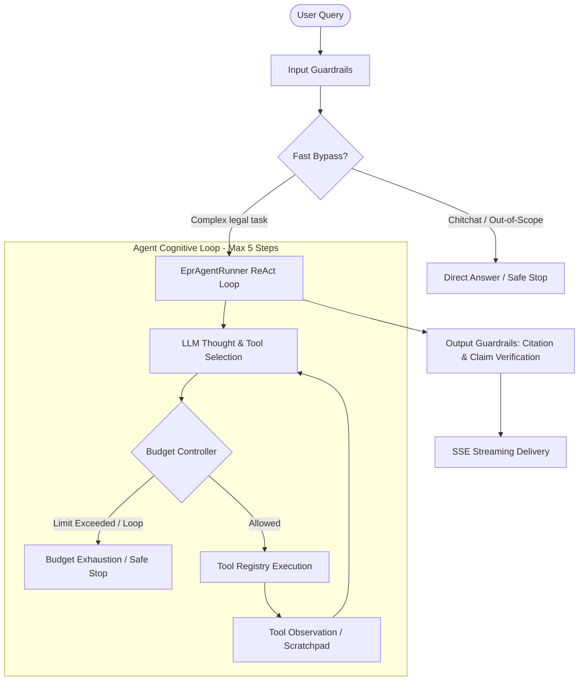

# Vietnamese Legal Agent Architecture & Evaluation Harness

This document details the bounded **Vietnamese Legal Agent** architecture
(ReAct cognitive loop) and the trajectory evaluation harness integrated under
the `pipeline-agent` pipeline version. EPR remains one supported legal domain,
not the product-wide identity.

---

## 1. Architectural Comparison: Bounded Workflow vs. Autonomous Agent

| Dimension | Bounded Workflow (`pipeline-v4`) | Autonomous Agent (`pipeline-agent`) |
|---|---|---|
| **Execution Model** | Deterministic LangGraph state machine with static transitions. | **ReAct Cognitive Loop** (Reason $\rightarrow$ Act $\rightarrow$ Observe). |
| **Planning** | One-shot static classifier (`QueryPlan`) determining fixed routes upfront. | **Multi-step Dynamic Planning**: The LLM evaluates intermediate tool outputs to determine the next action. |
| **Tool Calling** | Hardcoded logic invoking retrieval or rule packs per route. | **Dynamic Tool Registry**: 9 standardized tools selected dynamically based on information needs. |
| **Fault Recovery** | Fixed retry count (max 2 searches for legal lookup). | **Autonomous Query Reformulation & Recovery** upon empty retrieval results. |
| **Budget Control** | Node-level branching limits. | **AgentBudgetController**: Enforces `max_steps=5`, `max_search=4`, and loop detection. |
| **Layman / Non-Expert Handling** | Requires specific structured input terms. | **Layman-Friendly**: Automatically maps colloquial terms (e.g. food containers, small workshops) to legal entities. |

---

## 2. Core Components



### 2.1. Tool Registry (`src/epr_agent/agent/tool_registry.py`)
The autonomous agent is equipped with a bounded registry of standardized tools:
1. `search_legal_provisions`: Vector search over legal provisions in Qdrant. Returns `suggested_followup_query` when provisions are insufficient.
2. `search_web_official`: Supplemental official domain search (`vanban.chinhphu.vn`, `vbpl.vn`).
3. `lookup_answer_cache`: Semantic lookup in the verified Redis answer cache.
4. `evaluate_legal_case`: Evaluates a supported legal scenario against the selected domain rules.
5. `evaluate_epr_obligation`: EPR-specific compatibility wrapper around the EPR Rule Pack.
6. `get_case_form_fields`: Retrieves case form requirements and identifies missing facts for a scenario.
7. `calculate_statutory_amounts`: Runs bounded statutory calculations when the selected domain supports them.
8. `load_conversation_context`: Loads conversation history and active case facts.
9. `ask_user_for_clarification`: Requests missing facts from the user (terminal action).

### 2.2. Agent Budget Controller (`src/epr_agent/agent/planner.py`)
- Hard budget enforcement: `max_steps = 5` per turn, `max_search_calls = 4`, `max_web_calls = 1`.
- **Loop Detection Engine**: Tracks hash signatures of `(tool_name, arguments)`. Duplicate tool calls with identical arguments are blocked immediately with a diagnostic message instructing the LLM to alter strategy.

### 2.3. Outer Guardrails (`src/epr_agent/agent/guardrails.py`)
- **Input Guardrails**: Rejects empty queries or inputs exceeding 3,000 characters.
- **Output Guardrails**: Verifies that 100% of legal claims carry grounded citation indices `[n]` matched to evidence (`verify_citations` and `StructuredClaimSupportVerifier`).

---

## 3. Layman & Non-Expert User Support

The agent is specifically optimized for non-lawyer users (small business owners, workshops, retail operators):
- **Colloquial Terminology Mapping**:
  - *"Xưởng em làm / xưởng tôi làm"* $\rightarrow$ Manufacturer (`manufacturer`)
  - *"Hộp xốp, túi ni-lông, ly nhựa"* $\rightarrow$ Commercial packaging (`commercial_packaging` / `plastic`)
  - *"Bán cho quán ăn, bán ở chợ"* $\rightarrow$ Domestic market placement (`vietnam_market`)
- **Domain-specific clarification**: Explains role and obligation differences in plain language, including the distinction between packaging consumers and EPR-responsible producers.
- **Step-by-Step Guidance**: When users pose vague or incomplete questions, the agent initiates clear, step-by-step clarification covering the 3 core dimensions: Product type, Market placement, and Revenue threshold.

---

## 4. Evaluation Harness & Benchmarks

The repository includes a comprehensive trajectory evaluation harness:
- Test Manifest: [`tests/eval/agent_manifest.py`](../../tests/eval/agent_manifest.py) (18 test cases across 11 categories).
- Harness Runner: [`tests/eval/agent_harness.py`](../../tests/eval/agent_harness.py).

### Running Benchmarks:
```bash
# Run all 18 benchmark test cases
python tests/eval/agent_harness.py --suite all

# Run layman / non-expert user flow tests
pytest tests/eval/test_non_user_flows.py -v
```

### Benchmark Results:
- **Pass Rate**: 100.0% (18/18 test cases).
- **Step Efficiency**: Average of 1.83 steps / turn (well within the 5-step budget).
- **Average Latency**: ~2.7ms (deterministic harness execution).
