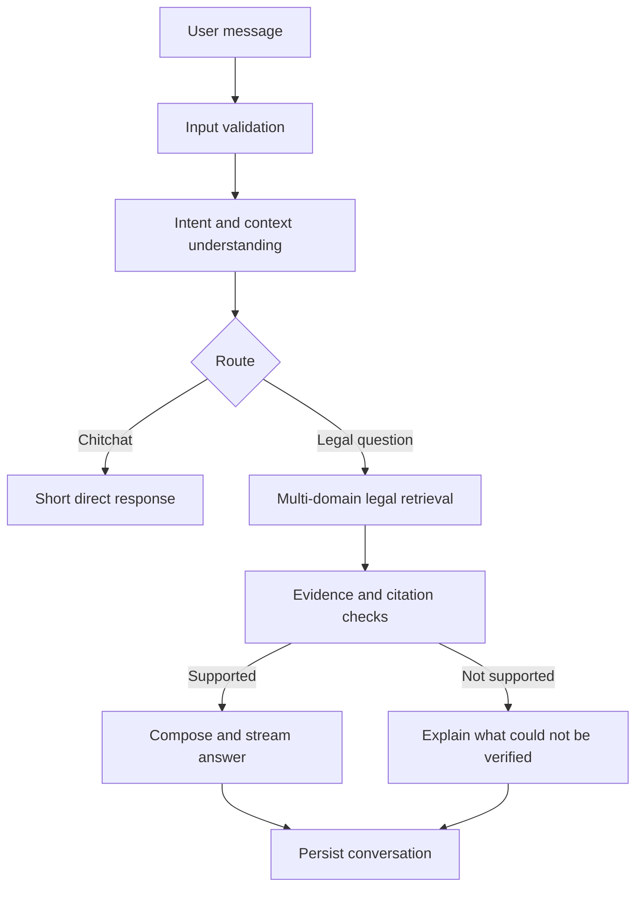

# Vietnamese Legal Agent Architecture

The product is a general Vietnamese legal assistant. Users describe a legal
question in ordinary language; they do not need to select a legal domain or
complete a preset case form.

## Request flow

```mermaid
flowchart TD
    User[User message] --> Input[Input validation]
    Input --> Understand[Intent and context understanding]
    Understand --> Route{Route}
    Route -->|Chitchat| Direct[Short direct response]
    Route -->|Legal question| Retrieve[Multi-domain legal retrieval]
    Retrieve --> Verify[Evidence and citation checks]
    Verify -->|Supported| Answer[Compose and stream answer]
    Verify -->|Not supported| Stop[Explain what could not be verified]
    Answer --> History[Persist conversation]
    Stop --> History
```

Ordinary legal lookup uses LangChain's two-step RAG pattern: retrieve, then
generate from the retrieved documents. The original user question and up to
two supplemental search queries from the existing intent-understanding step
go to the legal corpus retriever. LangChain's `EnsembleRetriever` applies
reciprocal-rank fusion across those corpus result lists, then combines them
with results from the allowlisted official-web retriever. The corpus gateway
remains the owner of its established per-query ranking;
`create_retrieval_chain` passes the fused documents to the standard
stuff-documents answer chain. Production requires legal review of the selected
corpus and a promoted release artifact.

## Runtime boundaries

- `pipeline-v4` runs a bounded workflow with server-owned routes and transitions.
- `pipeline-agent` runs a bounded ReAct loop using the registered tools below.
- Both paths use retrieved sources, citation checks, and persisted conversation
  history. Neither may turn an unverified citation into a legal conclusion.
- Assessments and procedural lists are requests expressed in chat. The product
  does not ask users to fill a domain-specific intake form before responding.
- The old Python package namespace and selected API fields remain as migration
  aliases. They do not define the product name, default domain, or retrieval
  scope.

## Autonomous tool registry

The current ReAct registry contains five tools:

1. `search_legal_provisions` retrieves legal text and relevant anchors.
2. `search_web_official` searches allowlisted official legal sources when the
   autonomous workflow needs an additional source.
3. `lookup_answer_cache` checks verified answers within corpus identity.
4. `load_conversation_context` loads recent messages and persisted context.
5. `ask_user_for_clarification` asks a short question when a material fact is
   necessary; it does not impose a fixed intake form.

Deterministic statutory formulas and form resolvers are not exposed as agent
tools. Calculations or case conclusions must be supported by the retrieved
legal source and the user's stated facts.
