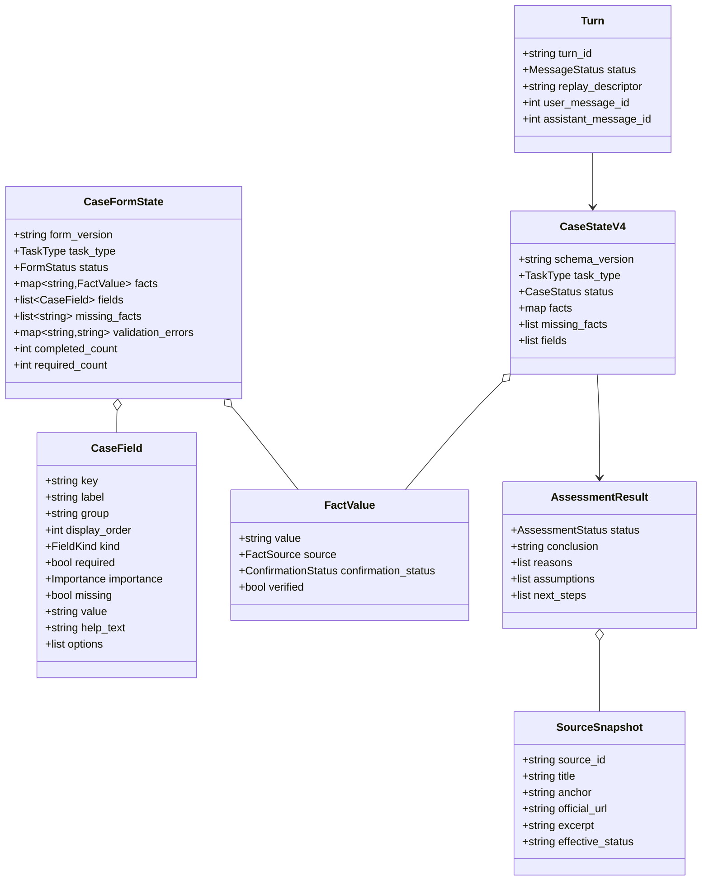
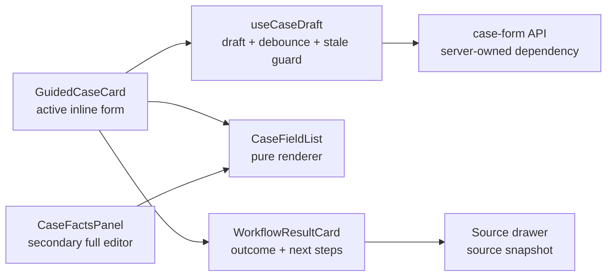

# Domain model

## Core contracts

The diagram describes data ownership, not React functions as object-oriented
classes. `CaseFormState` is the resolver response; `CaseStateV4` is the
persisted case contract; presentation fields are hydrated without a migration.

## Component responsibility

`GuidedCaseCard` owns the primary journey. `CaseFactsPanel` owns save-for-later
editing only. `CaseFieldList` never performs API calls. `useCaseDraft` does not
write sensitive draft data to local or session storage. `CaseFormResolver` does
not persist data and never creates a legal conclusion.
