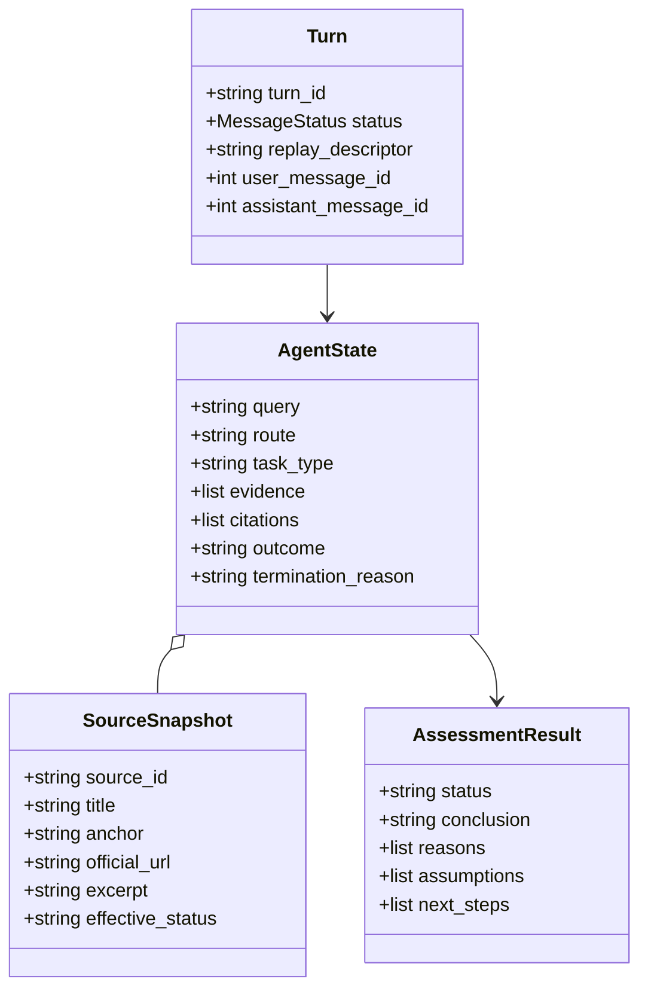

# Domain model

## Legal chat

The user-facing contract is a conversation containing user and assistant
messages, source snapshots, citations, and an optional structured result. The
user may ask a direct legal question, describe a personal situation, request a
procedure, or continue a prior question in the same chat.

```mermaid
classDiagram
    class Turn {
        +string turn_id
        +MessageStatus status
        +string replay_descriptor
        +int user_message_id
        +int assistant_message_id
    }
    class AgentState {
        +string query
        +string route
        +string task_type
        +list evidence
        +list citations
        +string outcome
        +string termination_reason
    }
    class SourceSnapshot {
        +string source_id
        +string title
        +string anchor
        +string official_url
        +string excerpt
        +string effective_status
    }
    class AssessmentResult {
        +string status
        +string conclusion
        +list reasons
        +list assumptions
        +list next_steps
    }
    Turn --> AgentState
    AgentState o-- SourceSnapshot
    AgentState --> AssessmentResult
```

## Conversation facts and legacy state

Some older conversations contain situation facts and task labels. User-provided
values remain available as conversational context, while retired form fields
are discarded. A prior assessment does not force unrelated new questions into
that workflow.

## Source and verification boundaries

- The multi-domain corpus is the default legal retrieval source in preview.
- Optional retrieval adapters must use a reviewed multi-domain corpus before
  they can be enabled alongside the default corpus.
- Retrieved material supplies evidence; it does not itself certify that every
  instrument is current or legally reviewed.
- Production requires a domain-neutral review and promotion gate. The legacy
  review manifest does not approve the full multi-domain corpus.
