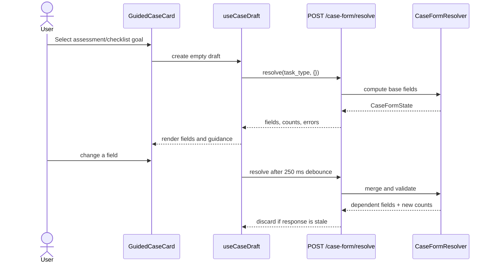
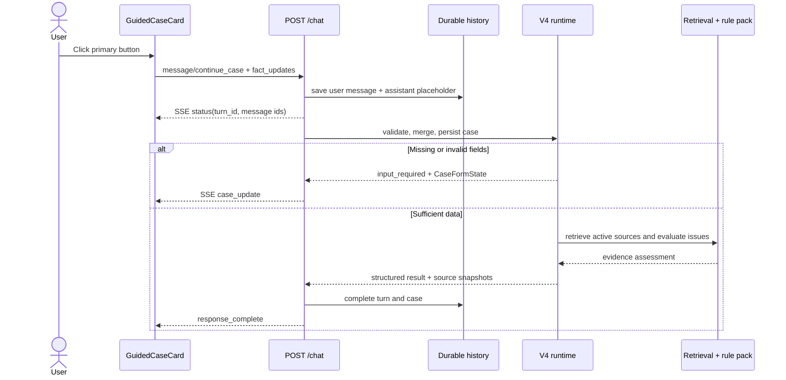
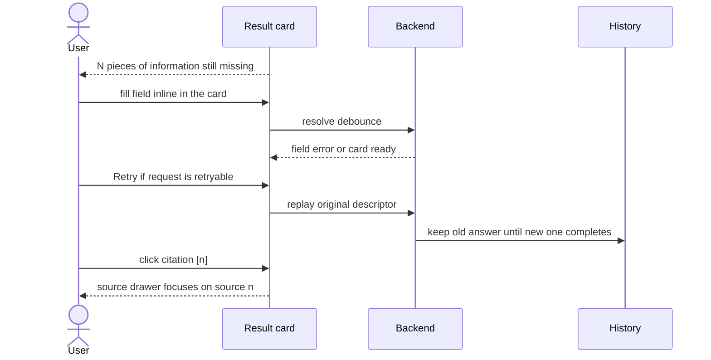
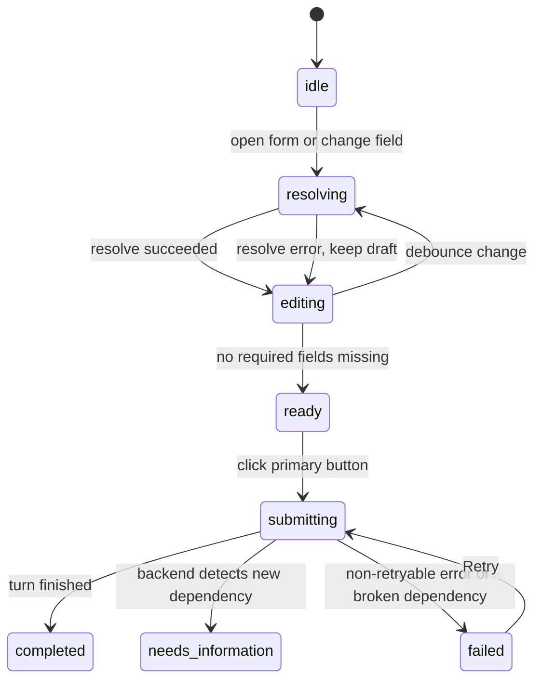

# Guided user flows

## End-to-end flows

| Goal | Entry point | Primary action | Result |
| --- | --- | --- | --- |
| Legal lookup | Composer | Send a question | Answer with citations |
| Case assessment | Welcome or assistant card | Fill the adaptive form, click **Kiểm tra trường hợp** | Preliminary assessment or request for more information |
| Compliance checklist | Welcome or assistant card | Fill the adaptive form, click **Tạo danh sách việc cần làm** | Checklist with actions and supporting citations |

The guided form supports all legal domains (labor, civil/contract, marriage
& family, corporate, land, traffic, EPR, and general) via `detect_legal_domain`
routing. The resolver adapts the field set to the detected domain.

The drawer only opens when the user wants to view or edit the full case
profile. It is not a required step to complete a case.

## Opening the form and resolving fields

## Atomic submit and SSE

## Missing information, retry, and citations

## Form state

