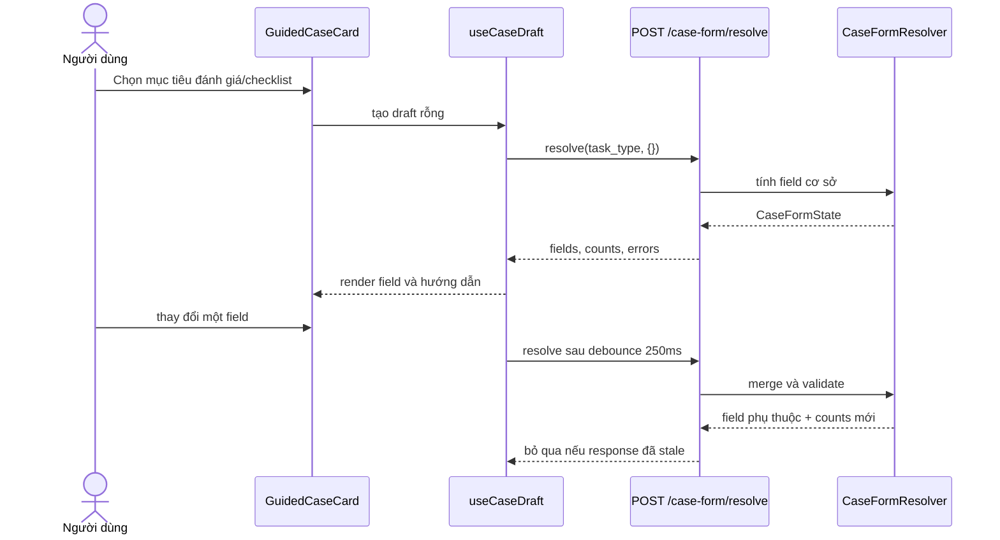
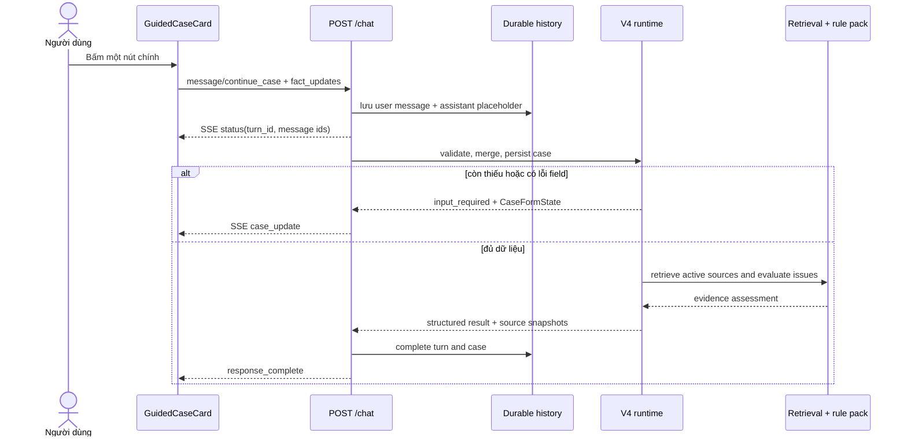
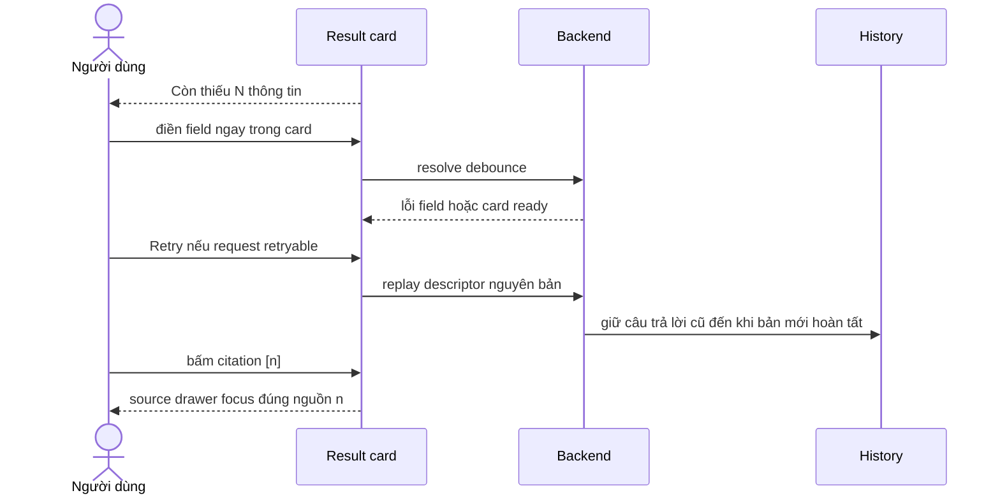
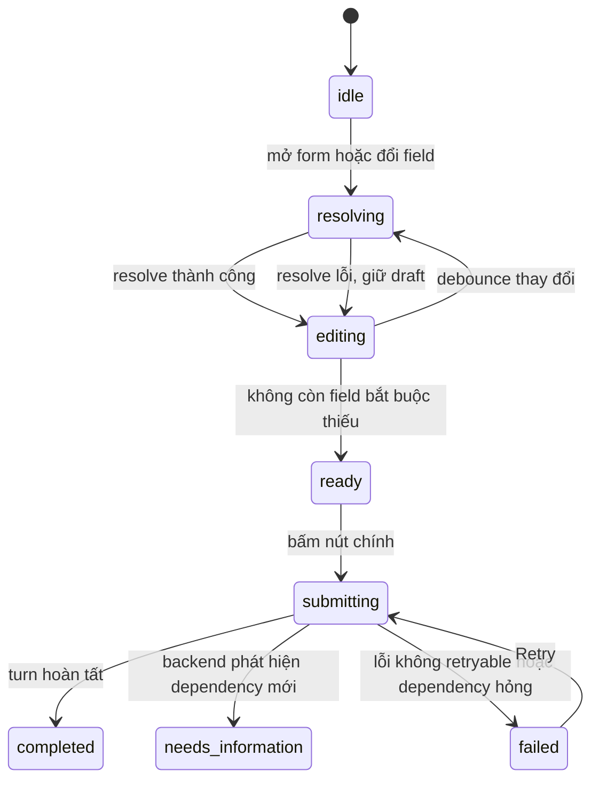

# Guided user flows

## Luồng cuối

| Mục tiêu | Entry point | Hành động chính | Kết quả |
| --- | --- | --- | --- |
| Tra cứu quy định | Composer | Gửi câu hỏi | Trả lời và căn cứ |
| Kiểm tra trường hợp | Welcome hoặc assistant card | Điền form thích ứng, bấm **Kiểm tra trường hợp** | Đánh giá sơ bộ hoặc yêu cầu bổ sung |
| Tạo danh sách việc cần làm | Welcome hoặc assistant card | Điền form thích ứng, bấm **Tạo danh sách việc cần làm** | Checklist có hành động và căn cứ |

Drawer chỉ mở khi người dùng muốn xem hoặc chỉnh sửa toàn bộ hồ sơ. Nó không
là bước bắt buộc để hoàn tất một case.

## Mở form và resolve field

## Submit atomic và SSE

## Missing information, retry và căn cứ

## Form state

