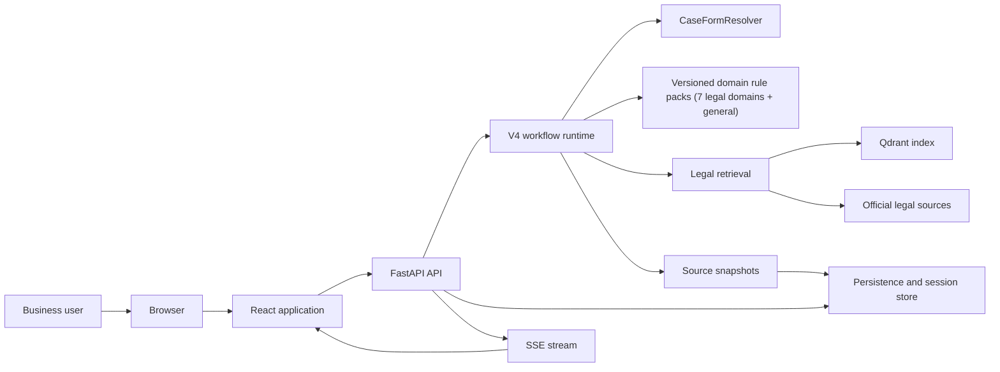
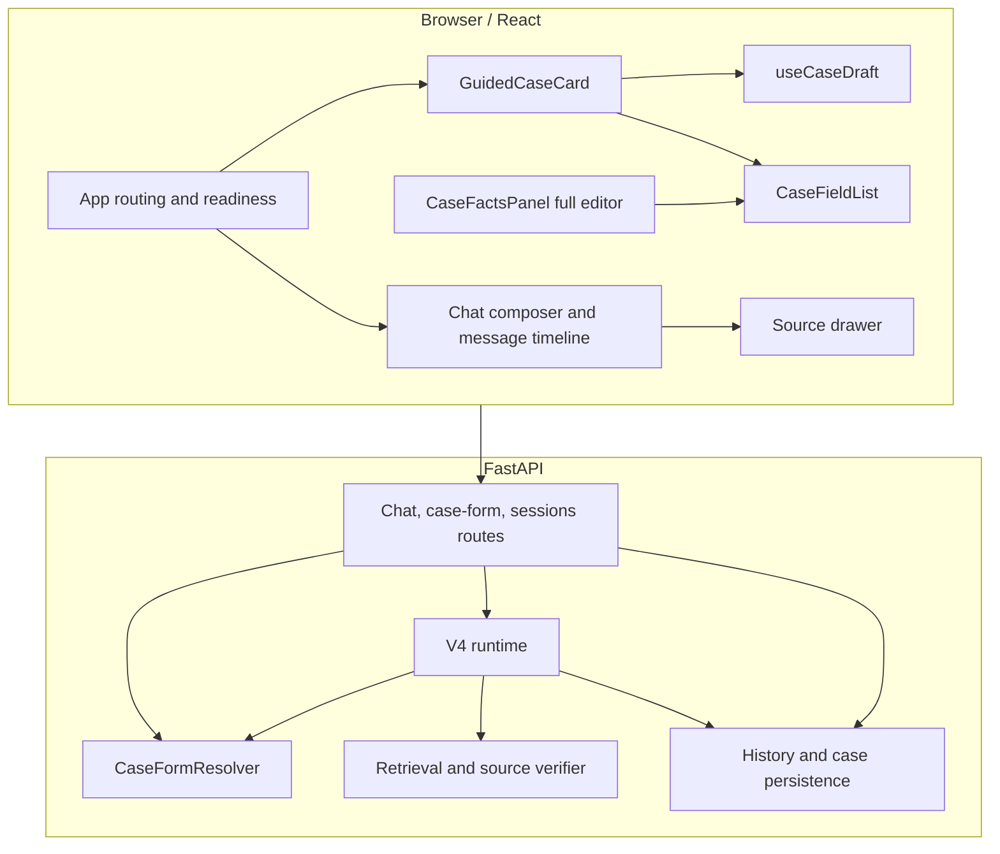

# System overview

## Purpose and scope

The application helps Vietnamese users:

1. look up a legal provision and open the original source document;
2. provide situational information to receive a grounded preliminary assessment;
3. generate a compliance checklist from the same set of facts.

The legal lookup flow and the case flow share history, identity, SSE, and source
snapshots but do not share business decisions. Retrieval finds sources; rule
packs and evidence assessment determine whether there is sufficient basis to
present a result.

## Context diagram

An alternative runtime, `pipeline-agent`, replaces the deterministic V4 graph
with an autonomous ReAct loop (see `autonomous-agent-architecture.md`).
The two runtimes share the same tool registry, domain rule packs, retrieval
layer, and persistence.

## Container and component boundaries

## Boundary rules

| Boundary | Owns | Does not own |
| --- | --- | --- |
| UI state | draft, focus, loading, dirty state, presentation copy | legal applicability or field dependencies |
| Case domain | typed facts, field visibility, validation, missing counts | persistence and legal conclusion |
| Legal decision | rule pack, issue coverage, assessment status, next steps | rendering or browser storage |
| Retrieval | candidate documents, active-source filtering, citations | inventing facts or declaring applicability |
| Persistence | ownership, turns, snapshots, replay metadata | changing a submitted fact silently |

## Request lifecycle

`POST /case-form/resolve` is pure and is safe to call while editing. A guided
submit sends one `/chat` request with typed updates. The backend merges and
validates the facts inside the durable turn before retrieval starts. A PATCH is
reserved for the secondary full editor and save-for-later behavior.
