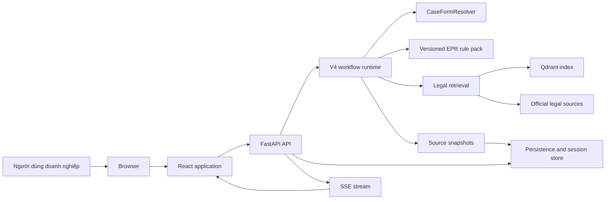
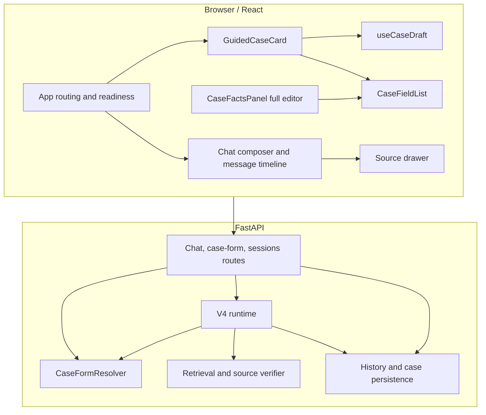

# System overview

## Mục tiêu và ranh giới

Ứng dụng giúp doanh nghiệp Việt Nam:

1. tra cứu một quy định EPR và mở văn bản gốc;
2. cung cấp thông tin doanh nghiệp để nhận một đánh giá sơ bộ có căn cứ;
3. tạo danh sách việc cần làm từ cùng một bộ thông tin.

Luồng legal lookup và luồng case dùng chung lịch sử, identity, SSE và source
snapshot nhưng không dùng chung quyết định nghiệp vụ. Retrieval tìm nguồn;
rule pack và evidence assessment quyết định liệu có đủ căn cứ để trình bày.

## Context diagram

## Container and component boundaries

## Boundary rules

| Boundary | Owns | Does not own |
| --- | --- | --- |
| UI state | draft, focus, loading, dirty state, presentation copy | legal applicability or field dependencies |
| Case domain | typed facts, field visibility, validation, missing counts | persistence and legal conclusion |
| Legal decision | rule pack, issue coverage, assessment status, next steps | rendering or browser storage |
| Retrieval | candidate documents, active-source filtering, citations | inventing facts or declaring applicability |
| Persistence | ownership, turns, snapshots, replay metadata | changing a submitted fact silently |

## Request lifecycle

`POST /case-form/resolve` is pure and is safe to call while editing. A guided
submit sends one `/chat` request with typed updates. The backend merges and
validates the facts inside the durable turn before retrieval starts. A PATCH is
reserved for the secondary full editor and save-for-later behavior.
