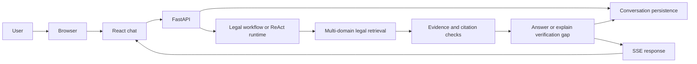
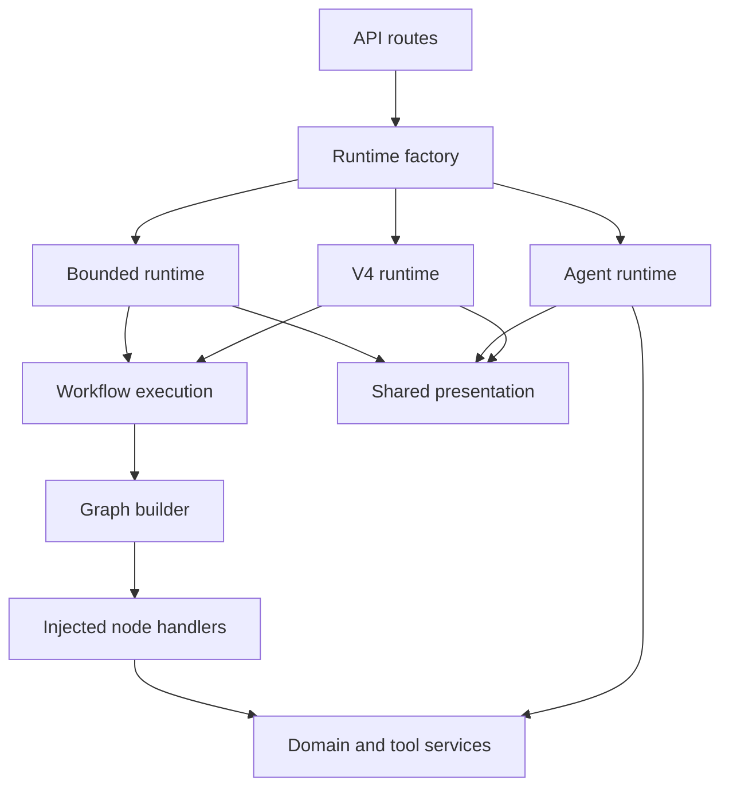

# System overview

## Purpose and scope

The application is an ordinary Vietnamese legal-chat assistant. Users ask
questions, explain a situation, or request procedural steps in their own
words. The assistant retrieves legal text, checks citations, and persists the
conversation. No legal topic selects a special default route or corpus.

## Context diagram

```mermaid
flowchart LR
    U[User] --> B[Browser]
    B --> F[React chat]
    F --> API[FastAPI]
    API --> W[Legal workflow or ReAct runtime]
    API --> P[Conversation persistence]
    W --> R[Multi-domain legal retrieval]
    R --> V[Evidence and citation checks]
    V --> A[Answer or explain verification gap]
    A --> P
    A --> SSE[SSE response]
    SSE --> F
```

The local preview uses a content-locked multi-domain SQLite corpus. Optional
retrieval adapters are disabled by default. Production remains blocked pending
legal review and a release artifact for the selected corpus.

## Runtime boundaries

- `pipeline-v4` uses server-owned routes and transitions.
- `pipeline-agent` uses a bounded ReAct loop and a five-tool registry.
- Both runtimes share retrieval, evidence checks, source snapshots, streaming,
  and persistence.
- Case assessments and procedural checklists are chat intents. They do not
  require an intake form or a case drawer.
- The user interface renders only verified sources and generic conversation
  state; legal applicability and evidence decisions remain on the server.

## Backend package boundaries

The backend keeps a `src/` package layout and separates public compatibility
imports from implementation modules:

| Package or module | Responsibility |
| --- | --- |
| `api/` | HTTP and SSE endpoints, request validation, response schemas |
| `agent/runtime/factory.py` | Select the server-configured runtime and expose `stream_chat` |
| `agent/runtime/presentation.py` | Shared SSE formatting, source snapshots, and response metadata |
| `agent/runtime/workflow.py` | Stream a bounded workflow turn |
| `agent/runtime/react.py` | Stream an autonomous agent turn and own its turn lifecycle |
| `agent/v4.py` | Pipeline V4 runtime orchestration |
| `agent/v4_support.py` | V4 state migration, context, evidence readiness, and delivery checks |
| `agent/workflow/contracts.py` | Injected workflow dependencies and shared workflow contracts |
| `agent/workflow/builder.py` | LangGraph topology and route edges |
| `agent/workflow/nodes/` | Intake, context, retrieval, answer, and verification behavior |
| `agent/workflow/execution.py` | Initial state creation and bounded workflow invocation |
| `agent/graph.py` | Compatibility facade for established workflow imports |
| `agent/runtime/__init__.py` | Lazy compatibility facade for established runtime imports |

Internal implementations import the narrow module that owns a capability.
The two facades preserve older callers while preventing new runtime code from
depending on a module that also selects runtimes. Workflow nodes receive their
services through `WorkflowDependencies`; the graph builder only wires handlers
and transitions. Retrieval and verification stay explicit stages so a missing
or invalid source cannot be hidden by presentation code.

```mermaid
flowchart TD
    API[API routes] --> RF[Runtime factory]
    RF --> RW[Bounded runtime]
    RF --> RA[Agent runtime]
    RF --> V4[V4 runtime]
    RW --> EX[Workflow execution]
    V4 --> EX
    EX --> GB[Graph builder]
    GB --> ND[Injected node handlers]
    ND --> D[Domain and tool services]
    RA --> D
    RW --> PR[Shared presentation]
    RA --> PR
    V4 --> PR
```

The graph and runtime facades are compatibility boundaries. The runtime facade
resolves exports lazily so importing one runtime does not load every runtime.
New implementation code should import `workflow.builder`, `workflow.contracts`,
`workflow.execution`, or a runtime implementation module directly.

## Request lifecycle

`POST /chat` receives a natural-language message and recent context. The
understanding layer selects the route, retrieval searches the selected
multi-domain source, verification checks claims and citations, and the server
streams and persists the result. If a material fact is missing, the assistant
may ask one short follow-up while answering the supported parts of the request.

Conversation facts from older sessions remain available as context. They are
not exposed through a separate case-form endpoint or used to force the route of
a new, unrelated question.
