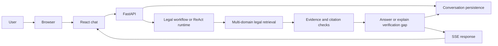

# System overview

## Purpose and scope

The application is an ordinary Vietnamese legal-chat assistant. Users ask
questions, explain a situation, or request procedural steps in their own
words. The assistant retrieves legal text, checks citations, and persists the
conversation. No legal topic selects a special default route or corpus.

## Context diagram

```mermaid
flowchart LR
    U[User] --> B[Browser]
    B --> F[React chat]
    F --> API[FastAPI]
    API --> W[Legal workflow or ReAct runtime]
    API --> P[Conversation persistence]
    W --> R[Multi-domain legal retrieval]
    R --> V[Evidence and citation checks]
    V --> A[Answer or explain verification gap]
    A --> P
    A --> SSE[SSE response]
    SSE --> F
```

The local preview uses a content-locked multi-domain SQLite corpus. Optional
retrieval adapters are disabled by default. Production remains blocked pending
legal review and a release artifact for the selected corpus.

## Runtime boundaries

- `pipeline-v4` uses server-owned routes and transitions.
- `pipeline-agent` uses a bounded ReAct loop and a five-tool registry.
- Both runtimes share retrieval, evidence checks, source snapshots, streaming,
  and persistence.
- Case assessments and procedural checklists are chat intents. They do not
  require an intake form or a case drawer.
- The user interface renders only verified sources and generic conversation
  state; legal applicability and evidence decisions remain on the server.

## Request lifecycle

`POST /chat` receives a natural-language message and recent context. The
understanding layer selects the route, retrieval searches the selected
multi-domain source, verification checks claims and citations, and the server
streams and persists the result. If a material fact is missing, the assistant
may ask one short follow-up while answering the supported parts of the request.

Conversation facts from older sessions remain available as context. They are
not exposed through a separate case-form endpoint or used to force the route of
a new, unrelated question.
