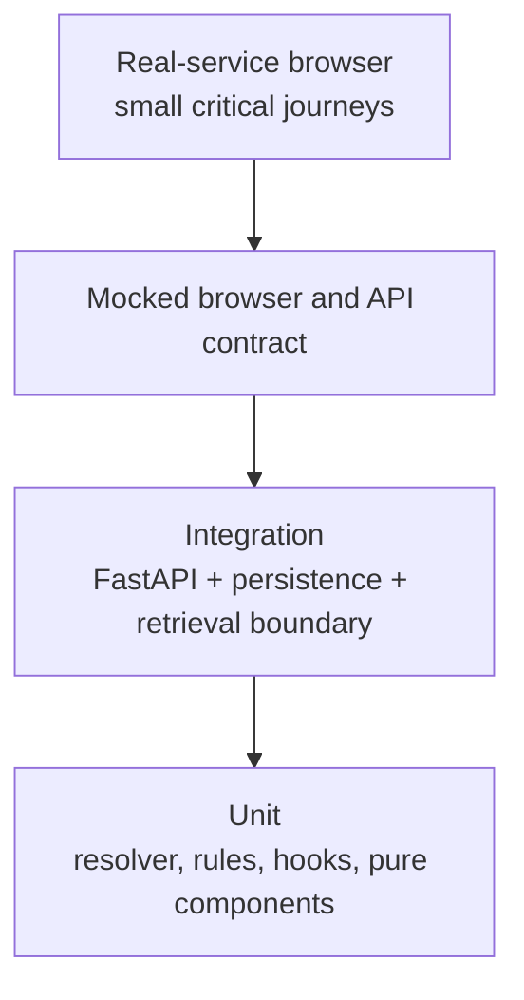

# Testing strategy

## Pyramid

## Responsibility matrix

| Area | Behavior contract | Primary tests | Owner |
| --- | --- | --- | --- |
| `CaseFormResolver` | field dependency, normalization, validation, counts | Python unit | domain |
| `/case-form/resolve` | pure response, no conversation side effect | FastAPI contract | API |
| V4 case execution | one turn, replay, ownership, safe-stop | integration | runtime |
| `CaseFieldList` | order, help, errors, conditional fields | Vitest | frontend |
| `useCaseDraft` | debounce, cancellation, stale response, dirty state | Vitest hook/component | frontend |
| `GuidedCaseCard` | one submit, retry, preserve draft | Vitest + mocked browser | frontend |
| source drawer | safe citation deep link and progressive metadata | Vitest + browser | frontend |
| history/auth | isolation, reload, error/retry | integration + browser | platform |

Every new domain service or user-facing boundary needs a behavior contract and
an explicitly named test owner. Coverage percentage alone is not a release
criterion.

## Release validation

Run Pytest, Ruff, Mypy, Vitest, TypeScript build, mocked Playwright, real
FastAPI Playwright and deterministic evaluation. Compose readiness and official
web smoke are external gates and must be reported separately when unavailable.
