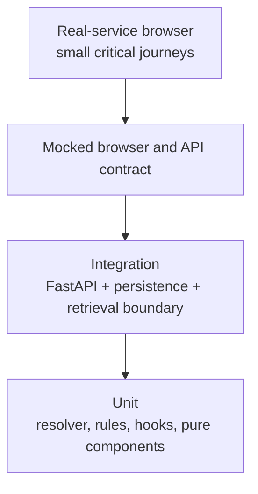

# Testing strategy

## Pyramid

## Responsibility matrix

| Area | Behavior contract | Primary tests | Owner |
| --- | --- | --- | --- |
| `CaseFormResolver` | field dependency, normalization, validation, counts | Python unit | domain |
| `UniversalCaseFormResolver` | multi-domain field schemas, validation, domain routing | Python unit | domain |
| `/case-form/resolve` | pure response, no conversation side effect | FastAPI contract | API |
| V4 case execution | one turn, replay, ownership, safe-stop | integration | runtime |
| Agent trajectory | step budget, tool selection, loop detection, budget controller | Python unit + eval harness | agent |
| Agent harness | 18 trajectory cases, tool call correctness, budget adherence | eval manifest | agent |
| Legal domain rules | deterministic evaluation per domain (labor, civil, corporate, land, traffic, EPR) | Python unit | domain |
| `CaseFieldList` | order, help, errors, conditional fields | Vitest | frontend |
| `useCaseDraft` | debounce, cancellation, stale response, dirty state | Vitest hook/component | frontend |
| `GuidedCaseCard` | one submit, retry, preserve draft | Vitest + mocked browser | frontend |
| source drawer | safe citation deep link and progressive metadata | Vitest + browser | frontend |
| history/auth | isolation, reload, error/retry | integration + browser | platform |

Every new domain service or user-facing boundary needs a behavior contract and
an explicitly named test owner. Coverage percentage alone is not a release
criterion.

## Test counts

- **574 passing pytest** unit and integration tests (**3 skipped** in the
  acceptance environment)
- **8 eval** pipeline evaluation modules (covering 40 E2E trajectories, 60 query-understanding cases, and 60 retrieval cases)
- **18 agent** trajectory test cases
- **27 Playwright** browser integration tests

## Release validation

Run Pytest, Ruff, Mypy, Vitest, TypeScript build, mocked Playwright, real
FastAPI Playwright and deterministic evaluation. Compose readiness and official
web smoke are external gates and must be reported separately when unavailable.
