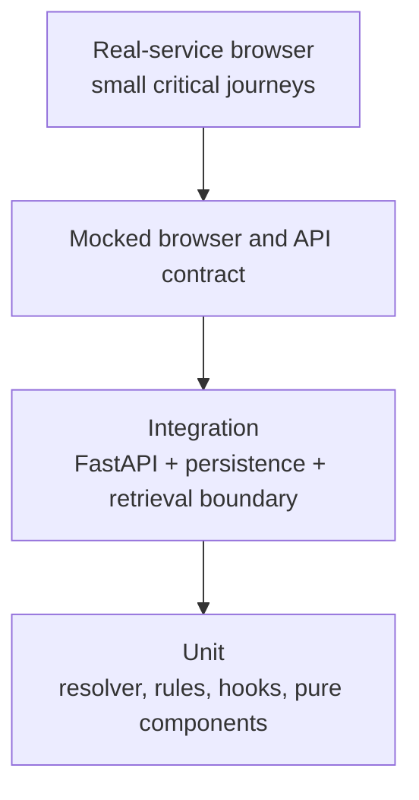

# Testing strategy

## Pyramid

```mermaid
flowchart TB
    E2E["Real-service browser\nsmall critical journeys"]
    B["Mocked browser and API contract"]
    I["Integration\nFastAPI + persistence + retrieval boundary"]
    U["Unit\nresolver, rules, hooks, pure components"]
    E2E --> B --> I --> U
```

## Responsibility matrix

| Area | Behavior contract | Primary tests | Owner |
| --- | --- | --- | --- |
| Intent understanding | route and task match user intent across legal topics | Python unit / API | domain |
| Multi-domain retrieval | corpus selection, query retrieval, source provenance | Python unit / API | retrieval |
| Evidence verification | supported claims, effective status, and citation correctness | Python unit / integration | safety |
| Conversation persistence | turn order, ownership, reload, and legacy state normalization | integration | platform |
| Agent trajectory | step budget, tool selection, loop detection, budget controller | Python unit + eval harness | agent |
| Agent harness | 18 trajectory cases, tool call correctness, budget adherence | eval manifest | agent |
| Domain routing and retrieval | query understanding, source selection, and evidence validation across legal topics | Python unit / API | domain |
| Welcome screen | exactly three optional intents, free-text chat, no sample-question form | Vitest | frontend |
| Ordinary chat | send, stream, stop, retry, and keep user text | Vitest + mocked browser | frontend |
| source drawer | safe citation deep link and progressive metadata | Vitest + browser | frontend |
| history/auth | isolation, reload, error/retry | integration + browser | platform |

Every new domain service or user-facing boundary needs a behavior contract and
an explicitly named test owner. Coverage percentage alone is not a release
criterion.

## Historical test counts

The following counts are from the 2026-08 acceptance snapshot and do not
validate later product-scope changes:

- **574 passing pytest** unit and integration tests (**3 skipped** in the
  acceptance environment)
- **8 eval** pipeline evaluation modules (covering 40 E2E trajectories, 60 query-understanding cases, and 60 retrieval cases)
- **18 agent** trajectory test cases
- **27 Playwright** browser integration tests

## Release validation

Run Pytest, Ruff, Mypy, Vitest, TypeScript build, mocked Playwright, real
FastAPI Playwright and deterministic evaluation. Compose readiness and official
web smoke are external gates and must be reported separately when unavailable.
